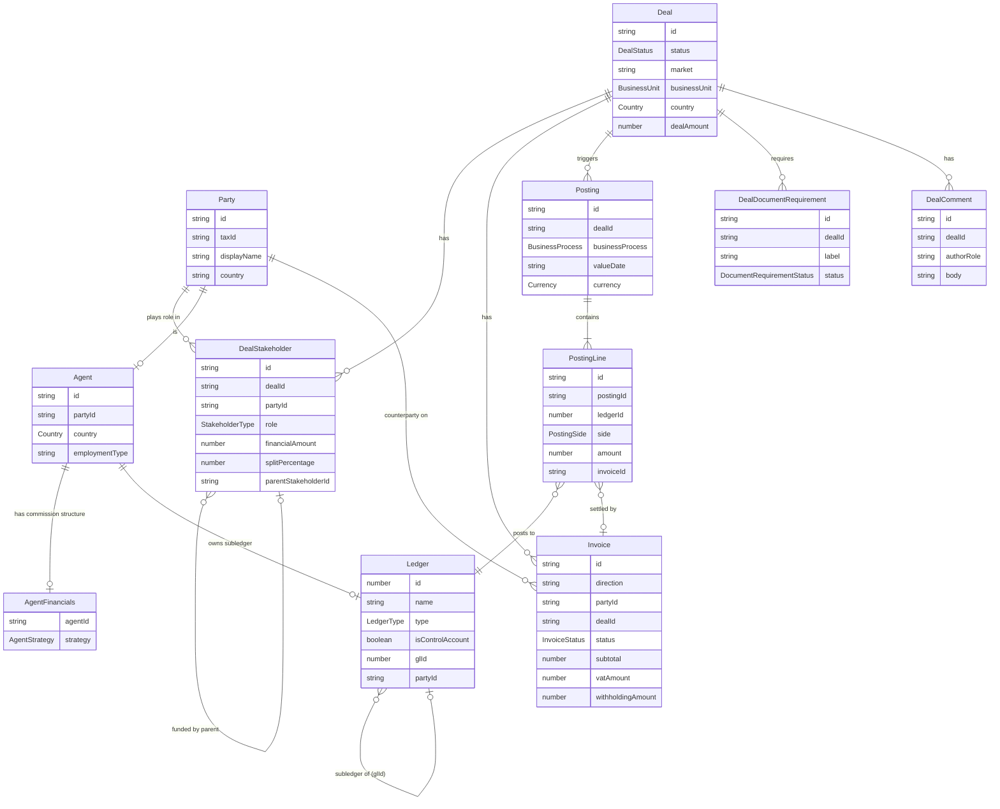

# Domain Model — Entity Relationships

This page explains how the core entities in the Deals system connect to each other. It is the authoritative reference for anyone building on, integrating with, or reasoning about the data model.

---

## Entity Relationship Diagram

---

## How the Entities Connect

### Party — the identity anchor

`Party` is the single identity record for every person or organisation in the system: buyer, seller, developer, bank, notary, agent. Deduplicated by `taxId` (NIE in Spain, Emirates ID in UAE). All other entities that represent a person point here — `Agent`, `DealStakeholder`, and `Invoice` all carry a `partyId`.

### Deal → DealStakeholder → Party

A `Deal` has no notion of "who is involved" by itself. All financial and identity participants are expressed as `DealStakeholders`. Each stakeholder links a `Party` to the deal with a role:

| Role | Effect on waterfall |
|---|---|
| `REVENUE_SOURCE` | Adds to gross revenue |
| `INTERNAL_PAYOUT` | Agent commission — calculated from `AgentFinancials.strategy` |
| `ACQUISITION_DEDUCTION` | Deducted from gross (external partner, referral) |
| `OPERATIONAL_DEDUCTION` | Deducted from gross (notary, conveyance) |
| `DEMAND` | Buyer / tenant / borrower — identity only, no financial effect |
| `SUPPLY` | Seller / developer / lender — identity only, no financial effect |

**Sub-stakeholders:** A `DealStakeholder` can carry a `parentStakeholderId`, linking it to an `INTERNAL_PAYOUT` stakeholder. When set, the cost is deducted from the parent agent's commission pool rather than from Huspy's gross revenue (e.g. a referral fee funded by the agent's own cut, not by Huspy).

### Agent → AgentFinancials → commission strategy

`Agent` is Huspy's own agent record. It extends `Party` (via `partyId`), carries the country and employment type (`commission` or `salaried`), and links to `AgentFinancials`, which stores the commission strategy:

| Strategy | How it works |
|---|---|
| `flat` | Fixed % of the agent's allocated commission base |
| `slab` | Progressive tiers — each rate applies to the slice between thresholds |
| `max` | Flat % capped at a maximum payout amount |

`AgentFinancials` also tracks connected agents (Team Lead, Manager) and their overhead rates, which are calculated on top of the base agent's payout.

### Deal → Invoice → PostingLine

When a deal reaches `invoicing`, an outbound `Invoice` is created linking the `Deal` to the receivable `Party`. When the agent submits a statement, an inbound `Invoice` is created linking back to the `Party` (the agent).

`Invoice` is directional:

| `direction` | Who sends it | Effect |
|---|---|---|
| `outbound` | Huspy → client | Huspy collects |
| `inbound` | Agent / vendor → Huspy | Huspy pays |

An invoice is settled when all its linked `PostingLines` (those with `invoiceId` set) are cleared by a `bank_statement` posting.
$$not clear$$

### Posting → PostingLine → Ledger

Every business event creates a `Posting`, which groups one or more `PostingLine` records. Each line debits or credits a specific `Ledger`. All lines on a posting must sum to zero (balanced double-entry).

Key posting types and what they do:

| Business process | What it records | $$ are they all? check fixtures $$
|---|---|
| `invoice_issued` | DR AR / CR Revenue + CR VAT Liability | $$ do we also have the payable ledger here? depending on the invoice direction i think $$
| `bank_statement_inbound_matched` | DR Bank / CR AR — cash received from client |
| `commission_accrual` | DR Commission Expense / CR Agent Liability — Huspy owes the agent |
| `agent_invoice_accrual` | Restructures Agent Liability into net payable + withholding tax |
| `bank_statement_outbound_matched` | DR Agent Liability / CR Bank — cash paid to agent or vendor |
| `manual_adjustment` | Finance-entered correction (bonus, reversal, platform fee) |

### Ledger → subledger hierarchy

`LIAB_AGENT_{CUR}` is a control account (marked `isControlAccount: true`). Individual agent subledgers (`AgentLiability_agent-{slug}`) point back to it via `glId`. You never post directly to a control account — always to the subledger. The control account balance equals the sum of all its subledgers.

The same pattern applies to `LIAB_PAYABLE_{CUR}` for external vendor payables. $$ are you sure? I do not think we have subledgers there $$

### DealDocumentRequirement — per-deal checklist

When a deal is created, `DealDocumentRequirement` rows are instantiated from the matching `DocumentRequirementTemplate` (filtered by market, business unit, and country). Ops approves or waives each requirement in Karvel. A deal cannot advance from `under-review` to `pending-agent-approval` until all requirements are either `approved` or `waived`.

---

## Key Invariants

- Every `Party` is unique by `taxId`. Always look up before creating.
- Every `Posting`'s lines must sum to zero. The system rejects unbalanced postings.
- `DealStakeholder` financial entries are locked once the deal leaves `under-review`.
- `invoicing → finalized` is automatic — triggered when the last outbound invoice is marked Paid, never by a manual status change.
- Agent subledger balance at any point = sum of all CREDIT lines minus DEBIT lines on that ledger = what Huspy currently owes the agent.
