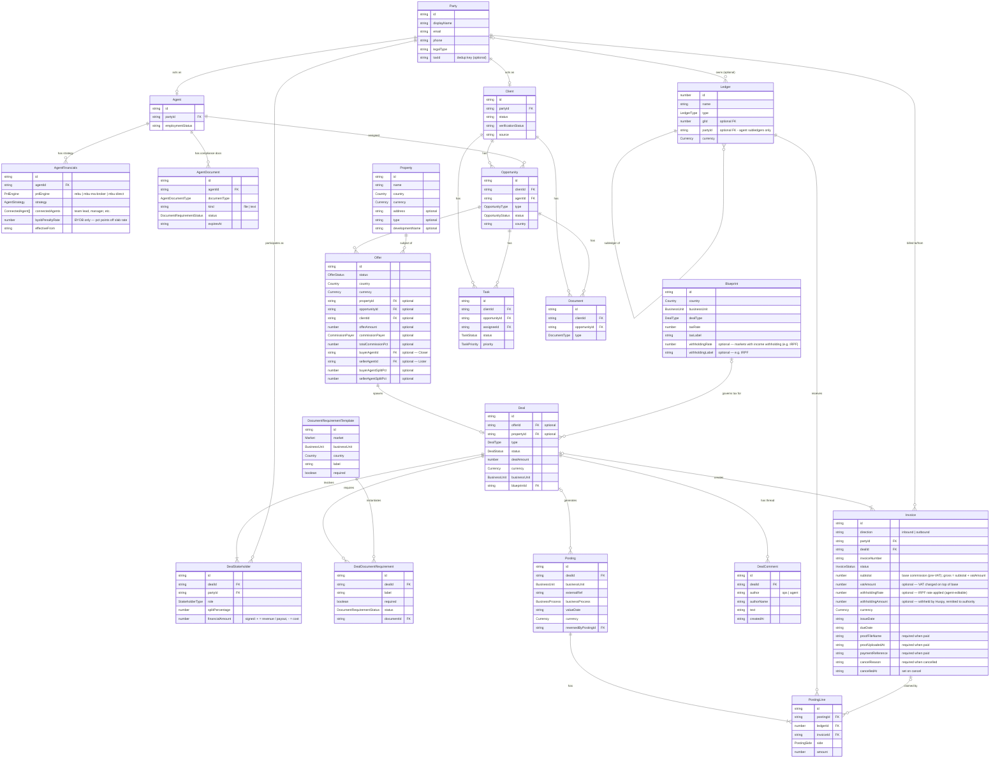

<!-- Confluence: https://huspy.atlassian.net/wiki/spaces/corp/pages/2431090692 -->

This page explains how the core entities in the Deals system connect to each other. It is the authoritative reference for anyone building on, integrating with, or reasoning about the data model.

# 1. Entity Relationship Diagram

````

````

# 2. Key Entities

| Entity | One-line summary |
| --- | --- |
| `Party` | Central identity record. `Agent` and `Client` are sub-types that link to a `Party` via `partyId`. Third parties (banks, developers, buyers, sellers) are also Parties. Deduplicated by `taxId`. Before creating a new Party record, look up by `taxId` |
| `Deal` | Central transaction record: status, amount, market, channel, BU, country. |
| `DealStakeholder` | Each deal now has one or more stakeholder records, each linking a Party to a **financial role** (`StakeholderType`). This naturally supports multi-agent commission splits and mixed revenue/cost structures. |
| `Invoice` | Billing instrument. Outbound (Huspy bills client) or inbound (agent/vendor bills Huspy). |
| `Posting` / `PostingLine` | Double-entry primitives — every business event creates a balanced posting across one or more ledger accounts. |
| `Ledger` | A GL account or agent/broker subledger in the chart of accounts. |

# 2. How the Entities Connect

### 2.1 Party - the identity anchor

`Party` is the single identity record for every person or organisation in the system: buyer, seller, developer, bank, notary, agent. Deduplicated by `taxId` . All other entities that represent a person/legal entity with which we interact with point here — `Agent`, `DealStakeholder`, and `Invoice` all carry a `partyId`.

### 2.2 Deal → DealStakeholder → Party

A `Deal` has no notion of "who is involved" by itself. All financial and identity participants are expressed as `DealStakeholders`. cStakeholders can be added at any point from deal creation up to — but not including — the transition to `invoicing` status. Each stakeholder links a `Party` to the deal with a role:

| Role | Effect on waterfall |
| --- | --- |
| `REVENUE_SOURCE` | Adds to gross revenue |
| `ACQUISITION_DEDUCTION` | Deducted from gross revenues |
| `INTERNAL_PAYOUT` | Agent commission — calculated from `AgentFinancials.strategy` |
| `OPERATIONAL_DEDUCTION` | Deducted from net revenues |
| `DEMAND` | Buyer / tenant / borrower / client — identity only, no financial effect |
| `SUPPLY` | Seller / developer / lender / bank — identity only, no financial effect |

**Sub-stakeholders:** A `DealStakeholder` can carry a `parentStakeholderId`, linking it to an `INTERNAL_PAYOUT` stakeholder. When set, the cost is deducted from the parent agent's commission pool rather than from Huspy's share (e.g. a referral fee funded by the agent's own cut, not by Huspy).

### 2.3 Party → Ledger

`ledger.partyId` is optional. Most GL accounts (revenue, expense, AR, bank) are company-wide and carry no `partyId`.

Agent/brokers/MCs/DS have subledgers set under general ledger `LIAB_AGENT_{CUR}`, because Huspy carries an ongoing liability to agents across multiple deals, the subledger balance matters between payout runs.

### 2.3 Agent → AgentFinancials → commission strategy

`Agent` is Huspy's own agent/broker/MC record. It extends `Party` (via `partyId`), carries the country and employment type (`commission` or `salaried`), and links to one or more `AgentFinancials` records.

`AgentFinancials` is keyed by `(agentId, pnlEngine)` — one record per engine the agent participates in. This supports multi-role agents: the same person can act as a REBU agent on some deals and a mortgage advisor (`mbu-direct`) on others, with different commission terms per role.

The `strategy` field defines how the agent commission is calculated:
- `rebu`: flat %, slab, or max/cap — stored per agent and applied as-is
- `mbu-ma-broker` and `mbu-direct`: rate resolved at runtime from monthly rate tables (BrokerRateSlabs / MBUDirectRates); the stored strategy is a marker (`broker-rate-slab` / `mbu-direct-rate-slab`)
- `manual`: no AF record needed — all payouts are fixed amounts declared on the deal

`connectedAgents` (team lead, manager, etc.) are configured per AF record and therefore per engine. They are auto-calculated on top of the agent's payout and never deducted from the agent's take-home. The `manual` engine does not auto-calculate connected agents — declare them as explicit `AGENT_PAYOUT` stakeholders.

An agent must have an AF record for the deal's engine before they can be added to a deal (validation enforced at deal creation and bulk upload). Fixed-amount stakes (`financialAmount` set) are exempt from this requirement.

### 2.4 Deal → Invoice → PostingLine

When a deal reaches `invoicing`, an outbound `Invoice` is created linking the `Deal` to the receivable `Party` (same for inbound invoices non-agent related). When the agent submits a statement, an inbound `Invoice` is created linking back to the `Party` (the agent). Not all invoices are linked to specific deals (e.g. agent invoice can group multiple deals related postinglines and non-deal specific postinlines). 

`Invoice` is directional:

| `direction` | Who sends it | Effect |
| --- | --- | --- |
| `outbound` | Huspy → client | Huspy collects |
| `inbound` | Agent / vendor → Huspy | Huspy pays |

Entry point by invoice type:

| Type | Auto-created on deal → `invoicing`? | Entry state | Advances to `issued` when… |
| --- | --- | --- | --- |
| Outbound (Huspy → client/developer/bank) | Yes | `draft` | Finance completes (due date, VAT) and sends PDF |
| Inbound — external vendor | Yes, unless the party has an agent/broker subledger — those are settled via commission accrual posting instead | `draft` | Vendor submits their invoice; Finance validates and updates details |
| Inbound — agent | No — decoupled from deal lifecycle | `issued` | Agent submits or on schedule; no draft stage |

An invoice is settled when the `PostingLine` entries linked to it (via `invoiceId`) are cleared by a `bank_statement` posting.

`Invoice` links directly to the Party being billed (outbound) or billing Huspy (inbound). 

### 2.5 Posting → PostingLine → Ledger

Every business event creates a `Posting`, which groups one or more `PostingLine` records. Each line debits or credits a specific `Ledger`. All lines on a posting must sum to zero (balanced double-entry).

Key posting types and what they do:

| `businessProcess` | Typical lines | Trigger |
| --- | --- | --- |
| `invoice_issued` | DEBIT `ASSET_AR_{CUR}` (gross = subtotal + vatAmount),  CREDIT `REV_{CUR}` (subtotal),  CREDIT `LIAB_VAT_{CUR}` (vatAmount).  | Triggered: outbound invoice draft → issued. |
| `bank_statement_inbound_matched` | DEBIT `ASSET_BANK_BankX_{CUR}` (gross),  CREDIT `ASSET_AR_{CUR}` (gross). | Triggered: outbound invoice issued → paid. |
| `commission_accrual` | DEBIT `EXP_COMMISSION_{CUR}` (gross base),  CREDIT `AgentLiability_agent-{slug}` (gross base).  | Triggered: deal statuc change, dependent on deal. No invoice exists yet, do not set `invoiceId`. |
| `agent_invoice_accrual` | DEBIT `AgentLiability_agent-{slug}` (base — clears the commission accrual debit),  DEBIT `LIAB_VAT_{CUR}` (input VAT),  CREDIT `LIAB_WITHHOLDING_TAX_{CUR}` (IRPF, Spain only),  CREDIT `LIAB_PAYABLE_{CUR}` (net payable = base + VAT − withholding).  | Triggered: agent invoice → issued. All lines tagged with `invoiceId`. |
| `external_cost_accrual` | DEBIT `EXP_COMMISSION_{CUR}` (subtotal),  DEBIT `LIAB_VAT_{CUR}` (vatAmount — input VAT reduces net VAT owed),  CREDIT `LIAB_PAYABLE_{CUR}` (gross). | Triggered: inbound vendor invoice draft → issued. All lines tagged with `invoiceId`. |
| `bank_statement_outbound_matched` | DEBIT `LIAB_PAYABLE_{CUR}`,  CREDIT `ASSET_BANK_BankX_{CUR}`.  | Triggered: inbound invoice issued → paid. Bank line is **not** tagged with `invoiceId`; payable-clearing line is tagged. |
| `manual_adjustment` | Flexible — use for standalone corrections |  |
| `reversal` | Mirror of reversed posting with sides flipped; set `reversedByPostingId` |  |

### 2.6 Ledger → subledger hierarchy

`LIAB_AGENT_{CUR}` is a control account (marked `isControlAccount: true`). Individual agent subledgers (`AgentLiability_agent-{slug}`) point back to it via `glId`. You never post directly to a control account — always to the subledger. The control account balance equals the sum of all its subledgers.

Key ledgers and what they do:

| Ledger pattern | Type | Notes |
| --- | --- | --- |
| `ASSET_BANK_BankX_{CUR}` | Asset | Operating bank account |
| `ASSET_AR_{CUR}` | Asset | Client accounts receivable |
| `LIAB_AGENT_{CUR}` | Liability | Control account — GL parent for all agent subledgers |
| `AgentLiability_agent-{slug}` | Liability | Subledger per agent |
| `LIAB_PAYABLE_{CUR}` | Liability | External partner payable (vendors, co-brokers) |
| `LIAB_VAT_{CUR}` | Liability | VAT collected and payable to tax authority |
| `LIAB_WITHHOLDING_TAX_{CUR}` | Liability | Withholding tax payable (IRPF in Spain) |
| `REV_{CUR}` | Revenue | All commission and fee revenue |
| `EXP_COMMISSION_{CUR}` | Expense | Agent commission expense (gross) |

# 3. Key Invariants

* Every `Party` is unique by `taxId`. Always look up before creating.
* Every `Posting`'s lines must sum to zero. The system rejects unbalanced postings.
* `DealStakeholder` financial entries are locked once the deal leaves `under-review`.
* `invoicing → finalized` is automatic — triggered when the last outbound invoice is marked Paid, never by a manual status change.
* Agent subledger balance at any point = sum of all CREDIT lines minus DEBIT lines on that ledger = what Huspy currently owes the agent.
