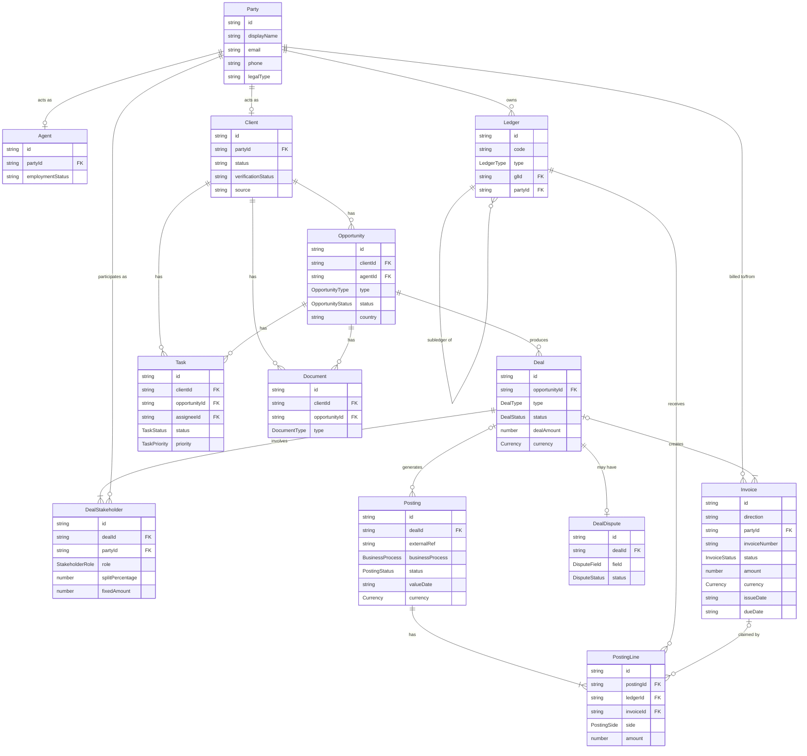

# Domain Model

All canonical types live in `src/entities.ts`. All enums live in `src/enums.ts`.

## Entity relationship diagram



## Key architectural decisions

### Party
Central identity record. `Agent` and `Client` are sub-types that link to a `Party` via `partyId`. Third parties (banks, developers) are also Parties — they have Party records but no Agent or Client records.

### DealStakeholder
Replaces the `agentId`/`clientId` FKs that used to be embedded on `Deal`. Each deal now has one or more stakeholder records, each linking a Party to a role (`agent`, `buyer`, `seller`, `tenant`, `borrower`, …). This naturally supports multi-agent commission splits.

### Posting.dealId (direct FK)
`Posting` now carries a direct `dealId` FK instead of the previous `metadata.deal_id` soft link. Standalone postings (bonuses, adjustments, platform fees not tied to a deal) leave `dealId` undefined — they remain first-class.

### Invoice.partyId
`Invoice` links directly to the Party being billed (outbound) or billing Huspy (inbound). This replaces the old `entityType`/`entityName`/`counterpartyId` pattern.

### Ledger.partyId
Per-agent subledgers (e.g. `AgentLiability_agent-felicia`) link to the agent's Party record via `partyId`, replacing `entityType`/`entityId`.

## Deal status state machine

```
reported → pending-details → under-review → pending-receivables → finalized
                                                                 ↘
                                           (any state) → canceled
```

| Status | Meaning |
|---|---|
| `reported` | Deal logged; awaiting ops review |
| `pending-details` | Ops requests more info from agent |
| `under-review` | Ops verifying details |
| `pending-receivables` | Invoice sent to client; waiting for payment to arrive |
| `finalized` | Client payment received and deal accounting closed |
| `canceled` | Deal voided (cross-cutting; can be reached from any state) |

> **`isDisputed`** (`boolean`) is a cross-cutting flag, NOT a state. A deal can be disputed at any lifecycle state.

## Accounting model

`Ledger`, `Posting`, and `PostingLine` implement double-entry bookkeeping.

### Ledger hierarchy

| Ledger ID | Type | GL? | Notes |
|---|---|---|---|
| `Receivables_Buyer` | asset | GL | Amounts owed by buyers |
| `Receivables_Seller` | asset | GL | Amounts owed by sellers |
| `Receivables_Developer` | asset | GL | Amounts owed by developers |
| `Receivables_Bank` | asset | GL | Mortgage bank receivables |
| `Bank_Operating` | asset | GL | Operating bank account |
| `Revenue_Commission_REBU` | revenue | GL | REBU commission revenue |
| `Revenue_Commission_MBU` | revenue | GL | MBU/mortgage commission revenue |
| `Revenue_PlatformFees` | revenue | GL | Platform support fee revenue |
| `AgentLiability` | liability | GL | Total owed to all agents (= Σ subledgers) |
| `AgentLiability_agent-*` | liability | subledger | One per agent; `glId = AgentLiability`, `partyId = party-agent-*` |

### Business processes and their posting shape

| `businessProcess` | Typical lines |
|---|---|
| `deal_close` | DEBIT Receivables_*, CREDIT Revenue_Commission_* |
| `bank_statement_inbound_matched` | DEBIT Bank_Operating, CREDIT Receivables_* |
| `agent_invoice` | DEBIT Revenue_Commission_*, CREDIT AgentLiability_[agentId] |
| `payout_instructed` | DEBIT AgentLiability_[agentId], CREDIT Bank_Operating |
| `bank_statement_outbound_matched` | DEBIT AgentLiability_[agentId], CREDIT Bank_Operating |
| `manual_adjustment` | Flexible — use for standalone fees, bonuses, corrections |
| `reversal` | Mirror of reversed posting with sides flipped; set `reversedByPostingId` |

## StakeholderRole values

| Role | Used when |
|---|---|
| `agent` | The Huspy agent handling the transaction |
| `buyer` | Client purchasing property (buy deal) |
| `seller` | Client selling property (sell deal) |
| `tenant` | Client renting (rent deal) |
| `landlord` | Property owner in a rental (lease deal) |
| `borrower` | Client taking a mortgage (mortgage deal) |
| `developer` | Property developer counterparty |
| `bank` | Mortgage bank counterparty |

## Query helpers (`src/fixtures/queries.ts`)

| Helper | Description |
|---|---|
| `getPostingsForDeal(dealId)` | Postings with `dealId === dealId` |
| `getInvoicesForDeal(dealId)` | Traverses Posting → PostingLine → Invoice |
| `getInvoicesForAgent(agentId)` | Inbound invoices where `partyId === agent.partyId` |
| `getDealStakeholdersForDeal(dealId)` | All stakeholders on a deal |
| `getDealStakeholdersForParty(partyId)` | All deals a party participates in |
| `getClientForDeal(dealId)` | Primary client record for a deal (via DealStakeholder) |
| `getPartyById(id)` | Party record by ID |
| `getPartyForAgent(agentId)` | Party record for an agent |
| `getPartyForClient(clientId)` | Party record for a client |
