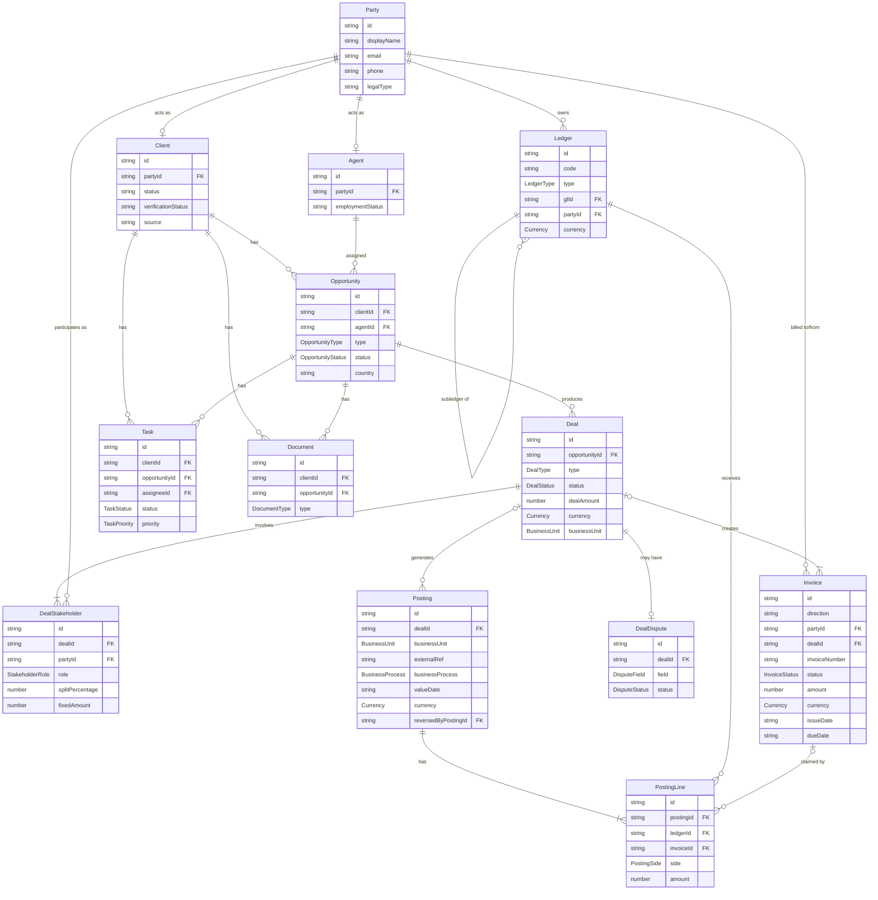

# Domain Model

All canonical types live in `src/entities.ts`. All enums live in `src/enums.ts`.

## Entity relationship diagram



## Key architectural decisions

### Party
Central identity record. `Agent` and `Client` are sub-types that link to a `Party` via `partyId`. Third parties (banks, developers) are also Parties — they have Party records but no Agent or Client records.

### DealStakeholder
Replaces the `agentId`/`clientId` FKs that used to be embedded on `Deal`. Each deal now has one or more stakeholder records, each linking a Party to a role (`agent`, `buyer`, `seller`, `tenant`, `borrower`, …). This naturally supports multi-agent commission splits.

### Posting.dealId (direct FK)
`Posting` carries a direct `dealId` FK. Standalone postings (bonuses, adjustments, platform fees not tied to a deal) leave `dealId` undefined — they remain first-class.

### Posting.businessUnit (dimension)
BU attribution (`rebu` | `mortgage`) lives on the `Posting` header, not in ledger names. This keeps the chart of accounts BU-neutral and lets the same ledger account (e.g. `REV_EUR`) serve multiple business units. Deal-linked postings inherit BU from the deal; standalone postings carry it explicitly.

### Posting reversal
A reversed posting sets `reversedByPostingId` pointing to the correcting entry. There is no separate status enum — a posting is either active (field absent) or reversed (field set).

### Invoice.partyId
`Invoice` links directly to the Party being billed (outbound) or billing Huspy (inbound). This replaces the old `entityType`/`entityName`/`counterpartyId` pattern.

### Ledger.partyId
Per-agent subledgers (e.g. `AgentLiability_agent-felicia`) link to the agent's Party record via `partyId`, replacing `entityType`/`entityId`.

## Deal status state machine

```
reported → pending-details → under-review → pending-receivables → finalized
                                                                 ↘
                                           (any state) → canceled
```

| Status | Meaning |
|---|---|
| `reported` | Deal logged; awaiting ops review |
| `pending-details` | Ops requests more info from agent |
| `under-review` | Ops verifying details |
| `pending-receivables` | Invoice sent to client; waiting for payment to arrive |
| `finalized` | Client payment received and deal accounting closed |
| `canceled` | Deal voided (cross-cutting; can be reached from any state) |

> **`isDisputed`** (`boolean`) is a cross-cutting flag, NOT a state. A deal can be disputed at any lifecycle state.

## Accounting model

`Ledger`, `Posting`, and `PostingLine` implement double-entry bookkeeping.

### Chart of accounts

One set of GL accounts per currency. BU attribution is a dimension on `Posting`, not embedded in ledger names.

| Ledger ID pattern | Type | Notes |
|---|---|---|
| `ASSET_BANK_BankX_{CUR}` | asset | Operating bank account |
| `ASSET_AR_{CUR}` | asset | Client accounts receivable |
| `LIAB_AGENT_PAYABLE_{CUR}` | liability | GL parent for all agent subledgers |
| `LIAB_EXTERNAL_PAYABLE_{CUR}` | liability | External partner payables |
| `LIAB_STATUTORY_TAX_{CUR}` | liability | Tax withheld at source (IRPF, VAT) |
| `REV_{CUR}` | revenue | All commission and fee revenue |
| `EXP_COMMISSION_{CUR}` | expense | Agent commission expense (gross) |
| `AgentLiability_agent-{slug}` | liability | Subledger per agent; `glId → LIAB_AGENT_PAYABLE_{CUR}`, `partyId → party-agent-{slug}` |

Supported currencies: `EUR`, `AED`, `SAR`.

### Business processes and their posting shape

| `businessProcess` | Typical lines |
|---|---|
| `deal_close` | DEBIT `ASSET_AR_{CUR}`, CREDIT `REV_{CUR}` |
| `bank_statement_inbound_matched` | DEBIT `Bank_Operating_{CUR}`, CREDIT `ASSET_AR_{CUR}` |
| `agent_invoice` | DEBIT `EXP_COMMISSION_{CUR}` (gross), CREDIT `AgentLiability_agent-{slug}` (net), CREDIT `LIAB_STATUTORY_TAX_{CUR}` (withheld) |
| `payout_instructed` | DEBIT `AgentLiability_agent-{slug}`, CREDIT `Bank_Operating_{CUR}` |
| `bank_statement_outbound_matched` | DEBIT `AgentLiability_agent-{slug}`, CREDIT `Bank_Operating_{CUR}` |
| `bonus` / `incentive` | DEBIT `EXP_COMMISSION_{CUR}`, CREDIT `AgentLiability_agent-{slug}` |
| `platform_fee` | DEBIT `AgentLiability_agent-{slug}`, CREDIT `REV_{CUR}` |
| `manual_adjustment` | Flexible — use for standalone corrections |
| `reversal` | Mirror of reversed posting with sides flipped; set `reversedByPostingId` |

### Tax withholding convention

- **EUR (Spain):** 19% IRPF withheld from gross agent commission → `LIAB_STATUTORY_TAX_EUR`
- **AED (UAE):** 5% VAT withheld → `LIAB_STATUTORY_TAX_AED`

Agent subledger is credited the **net** amount (gross − withheld). `EXP_COMMISSION` is always the **gross** amount.

## PnL service (`src/services/pnl.ts`)

| Export | Description |
|---|---|
| `getDealPnL(dealId)` | Revenue + commission expense for a single deal |
| `getBusinessUnitPnL(bu, currency)` | Aggregated P&L for a BU/currency slice; resolves BU from deal if posting carries no explicit override |

Revenue = sum of CREDIT lines on `REV_*` ledgers. Commission expense = sum of DEBIT lines on `EXP_COMMISSION_*` ledgers. Gross profit = revenue − commission expense.

## StakeholderRole values

| Role | Used when |
|---|---|
| `agent` | The Huspy agent handling the transaction |
| `buyer` | Client purchasing property (buy deal) |
| `seller` | Client selling property (sell deal) |
| `tenant` | Client renting (rent deal) |
| `landlord` | Property owner in a rental (lease deal) |
| `borrower` | Client taking a mortgage (mortgage deal) |
| `developer` | Property developer counterparty |
| `bank` | Mortgage bank counterparty |

## Query helpers (`src/fixtures/queries.ts`)

| Helper | Description |
|---|---|
| `getPostingsForDeal(dealId)` | Postings with `dealId === dealId` |
| `getInvoicesForDeal(dealId)` | Traverses Posting → PostingLine → Invoice |
| `getInvoicesForAgent(agentId)` | Inbound invoices where `partyId === agent.partyId` |
| `getDealStakeholdersForDeal(dealId)` | All stakeholders on a deal |
| `getDealStakeholdersForParty(partyId)` | All deals a party participates in |
| `getClientForDeal(dealId)` | Primary client record for a deal (via DealStakeholder) |
| `getPartyById(id)` | Party record by ID |
| `getPartyForAgent(agentId)` | Party record for an agent |
| `getPartyForClient(clientId)` | Party record for a client |
