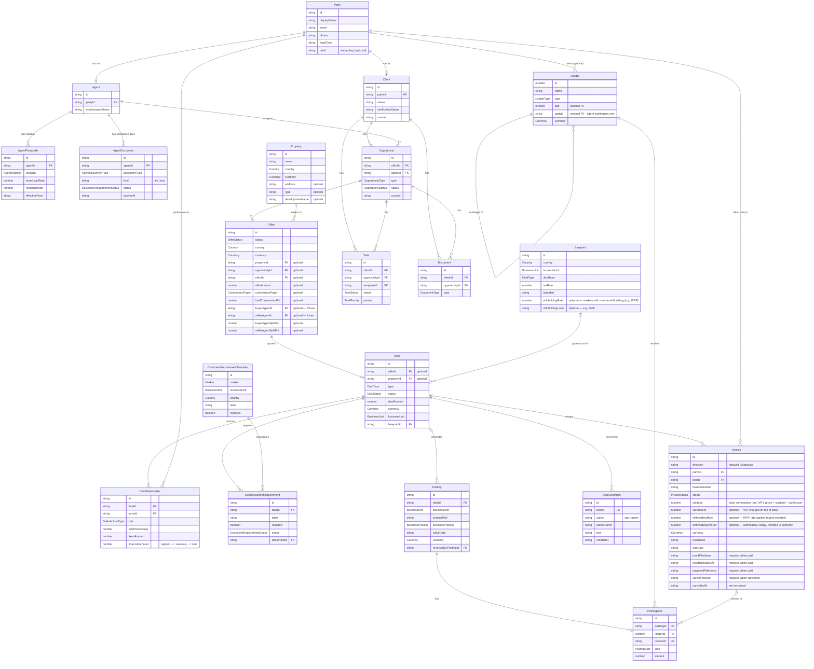

# Domain Model

All canonical types live in `src/entities.ts`. All enums live in `src/enums.ts`.

## Entity relationship diagram



## Key architectural decisions

### Party
Central identity record. `Agent` and `Client` are sub-types that link to a `Party` via `partyId`. Third parties (banks, developers, buyers, sellers) are also Parties — they have Party records but no Agent or Client records.

**Deduplication:** `taxId` is the canonical identity key for external parties. Before creating a new Party record, look up by `taxId`. If a match exists, reuse that Party and attach it as a `DealStakeholder` — do not create a duplicate. Agents are deduplicated by their account; `taxId` applies to all other party types.

### DealStakeholder and Party lifecycle
`DealStakeholder` records (and their linked Parties) can be added at any point from deal creation up to — but not including — the transition to `pending-receivables`. Once the deal enters `pending-receivables`, all stakeholders must be set: invoices reference `Party.id` directly and cannot be created without a resolved Party record.

Steps at deal creation or during ops review:
1. Operator enters the external party's details and `taxId`.
2. System looks up `taxId` — if found, link the existing Party; if not, create a new Party record.
3. A `DealStakeholder` row is created linking the Party to the deal with the appropriate role.
4. The deal may not advance to `pending-receivables` until all required stakeholders are present.

### DealStakeholder
Replaces the `agentId`/`clientId` FKs that used to be embedded on `Deal`. Each deal now has one or more stakeholder records, each linking a Party to a **financial role** (`StakeholderType`). This naturally supports multi-agent commission splits and mixed revenue/cost structures.

> **Note:** Agent split percentages are sourced from the `Offer` entity (`buyerAgentSplitPct`, `sellerAgentSplitPct`). `DealStakeholder.splitPercentage` is the runtime-resolved copy used by the waterfall engine.

### Posting.dealId (direct FK)
`Posting` carries a direct `dealId` FK. Standalone postings (bonuses, adjustments, platform fees not tied to a deal) leave `dealId` undefined — they remain first-class.

### Posting.businessUnit (dimension)
BU attribution (`rebu` | `mortgage`) lives on the `Posting` header, not in ledger names. This keeps the chart of accounts BU-neutral and lets the same ledger account (e.g. `REV_EUR`) serve multiple business units. Deal-linked postings inherit BU from the deal; standalone postings carry it explicitly.

### Posting reversal
A reversed posting sets `reversedByPostingId` pointing to the correcting entry. There is no separate status enum — a posting is either active (field absent) or reversed (field set).

### Invoice.partyId
`Invoice` links directly to the Party being billed (outbound) or billing Huspy (inbound). This replaces the old `entityType`/`entityName`/`counterpartyId` pattern.

### Ledger.partyId
`partyId` is optional. Most GL accounts (revenue, expense, AR, bank) are company-wide and carry no `partyId`.

Today only agent subledgers (e.g. `AgentLiability_agent-felicia`) set it, because Huspy carries an ongoing liability to agents across multiple deals — the subledger balance matters between payout runs.

**Buyers and sellers** are Parties but have no subledgers. Their receivables are tracked at the `Invoice` level (`Invoice.partyId` + `direction: "outbound"`  — Huspy sends the invoice), which is sufficient for one-shot, per-deal transactions. `ASSET_AR_{CUR}` is a shared GL that absorbs all client receivables.

**When to add external-party subledgers:** if a recurring external partner (referral firm, co-broker) accumulates payables across multiple deals and Huspy batch-pays them, mirror the agent pattern — add `ExternalLiability_partner-{slug}` subledgers under `LIAB_PAYABLE_{CUR}`. This is not in the current chart of accounts because no such batch-pay workflow exists yet.

## Deal status state machine

Implemented in `src/dealWorkflow.ts` — `DEAL_WORKFLOW_TRANSITIONS` is authoritative. Use `canTransitionDealStatus(from, to)` to validate any transition before applying it.

```
pending-details ⇄ under-review → pending-agent-approval → pending-receivables → finalized
                                          ↑          ↘
                                   under-review    (back if agent input needed)
                                
(any state) → canceled
```

Allowed transitions (from `dealWorkflow.ts`):

| From | Allowed next states |
|---|---|
| `pending-details` | `under-review`, `canceled` |
| `under-review` | `pending-details`, `pending-agent-approval`, `canceled` |
| `pending-agent-approval` | `under-review`, `pending-receivables`, `canceled` |
| `pending-receivables` | `finalized`, `canceled` |
| `finalized` | _(terminal)_ |
| `canceled` | _(terminal)_ |

| Status | Meaning |
|---|---|
| `pending-details` | Deal logged; ops awaiting required info from agent |
| `under-review` | Ops verifying deal details |
| `pending-agent-approval` | Ops has finalised commission terms; agent must confirm before invoicing begins |
| `pending-receivables` | Invoice sent to client; waiting for payment |
| `finalized` | Client payment confirmed; `invoice_issued` posting created, agent liability subledger credited |
| `canceled` | Deal voided — reachable from any state |

> **`isDisputed`** (`boolean`) is a cross-cutting flag, NOT a state. A dispute reverts the deal to `under-review` + sets `isDisputed = true`. Ops resolves in Karvel, then moves to `pending-details` (if more agent input needed) or back to `pending-agent-approval`.

> **Backward transitions are intentional.** `under-review → pending-details` is a normal ops workflow step (requesting more info from the agent), not an error.

## Invoice workflow

### Direction semantics

| Direction | Meaning | Typical party |
|---|---|---|
| `inbound` | Invoice received by Huspy; Huspy pays | Agent, vendor, authority |
| `outbound` | Invoice sent by Huspy; Huspy receives | Client (buyer, seller, tenant, bank) |

Agent invoices (agents billing Huspy for commission) are always `inbound`. Client invoices (Huspy billing the client for the commission fee) are always `outbound`.

### Status machine

```
draft → issued → paid
issued → cancelled  (cancelReason required)
paid   → cancelled  (cancelReason required)
cancelled → issued  (restore — for op error recovery)
```

**Entry point by invoice type:**

| Type | Auto-created on deal → `pending-receivables`? | Entry state | Advances to `issued` when… |
|---|---|---|---|
| Outbound (Huspy → client/developer/bank) | Yes | `draft` | Finance completes (due date, VAT) and sends PDF |
| Inbound — external vendor (conveyance, legal, co-broker) | Yes | `draft` | Vendor submits their invoice; Finance validates and updates details |
| Inbound — agent | No — decoupled from deal lifecycle | `issued` | Agent submits; no draft stage |

`issued → paid` requires both `proofFileName` and `paymentReference`. Neither alone is sufficient.

### Invoice ↔ deal status invariants

| Deal status | Outbound invoice constraint |
|---|---|
| `finalized` | ALL outbound invoices linked to the deal must be `paid` |
| `pending-receivables` | At least 1 outbound invoice must be `issued` |
| Any other status | No outbound invoice should be in `paid`, `issued`, or `draft` |

`pending-receivables → finalized` is gated on all outbound invoices being `paid`. Inbound invoice payment is never a gating condition for deal status.

### Invoice ↔ PostingLines accounting invariants

| Invoice state | Required posting lines (tagged via `PostingLine.invoiceId`) |
|---|---|
| Outbound `issued` | DEBIT `ASSET_AR_{CUR}` (gross), CREDIT `REV_{CUR}` (subtotal), CREDIT `LIAB_VAT_{CUR}` (vatAmount) |
| Outbound `paid` | + DEBIT `ASSET_BANK_BankX_{CUR}` (gross), CREDIT `ASSET_AR_{CUR}` (gross) |
| Inbound vendor `issued` | DEBIT `EXP_COMMISSION_{CUR}` (subtotal), DEBIT `LIAB_VAT_{CUR}` (vatAmount), CREDIT `LIAB_PAYABLE_{CUR}` (gross) |
| Inbound vendor `paid` | + DEBIT `LIAB_PAYABLE_{CUR}` (gross), CREDIT `ASSET_BANK_BankX_{CUR}` (gross) |
| Inbound agent `issued` | DEBIT `AgentLiability_agent-{slug}` (base), DEBIT `LIAB_VAT_{CUR}` (vatAmount), CREDIT `LIAB_WITHHOLDING_TAX_{CUR}` (withholdingAmount), CREDIT `AgentLiability_agent-{slug}` (net payable) |
| Inbound agent `paid` | + DEBIT `AgentLiability_agent-{slug}` (net payable), CREDIT `ASSET_BANK_BankX_{CUR}` (net payable) |

Finalized deals must have a posting with DEBIT `EXP_COMMISSION_{CUR}` and CREDIT `AgentLiability_agent-{slug}`.

### Rebate and subsidy — upstream model

Rebate and subsidy are price concessions returned to the client. They are baked into the client's `DealStakeholder.financialAmount` (REVENUE_SOURCE) — the stored amount is already net of both. They are **not** `ACQUISITION_DEDUCTION` stakeholders and never appear as waterfall deduction entries.

`deal.rebateAmount` = `rebatePercentage% × grossCommission` (sum of REVENUE_SOURCE `financialAmount`s). Never computed as `rebatePercentage × dealAmount`.

Both fields survive on `Deal` as reference data and appear as greyed context lines in the P&L waterfall below "Deal Amount".

## StakeholderType — financial role taxonomy

`StakeholderType` classifies a party's financial relationship to the deal. It drives the P&L waterfall engine — each type maps to a cost bucket (see below).

| Value | Bucket | Used when |
|---|---|---|
| `REVENUE_SOURCE` | — | Party paying Huspy. `financialAmount > 0` contributes to commissionable gross. |
| `AGENT_PAYOUT` | B | Huspy agent. Commission calculated via `AgentFinancials.strategy`; not manually entered. |
| `ACQUISITION_DEDUCTION` | C | External commercial partner (co-broker, referral agency). Huspy pays them. |
| `OPERATIONAL_DEDUCTION` | D | Fixed service provider (notary, conveyance, legal). Huspy pays a fixed fee. |
| `SUPPLY` | — | Non-financial role: supply-side party (seller, developer, landlord, bank/lender). No `financialAmount`. Replaces `Deal.sellerName`. |
| `DEMAND` | — | Non-financial role: demand-side party (buyer, tenant, borrower). No `financialAmount`. Primary DEMAND party is the canonical source for `Deal.clientName`. Replaces `Deal.buyerName`. |

## P&L waterfall — cost bucket taxonomy

The lean P&L engine applies deductions to gross revenue in bucket order:

| Bucket | Label | Source |
|---|---|---|
| A | Statutory tax / top-line reductions | Derived by engine from `Blueprint.taxRate` — not user-declared |
| B | Internal payouts (agents, team leads, managers) | Derived by engine from `AgentFinancials.strategy` |
| C | External commercial deductions (co-brokers, rebates) | User-declared via `DealStakeholder` with `ACQUISITION_DEDUCTION` |
| D | Operational service costs (notary, conveyance) | User-declared via `DealStakeholder` with `OPERATIONAL_DEDUCTION` |

Gross profit = Gross revenue − A − B − C − D.

## Blueprint — tax configuration

One `Blueprint` per `(country, businessUnit)` pair (optionally further scoped to a `dealType`). The engine reads the matching Blueprint at `invoice_issued` and emits `PostingLine` entries against `LIAB_STATUTORY_TAX_{CUR}`.

The P&L waterfall always operates on **tax-exclusive** amounts. Tax is handled entirely by the Blueprint service, not by stakeholder declarations.

## AgentFinancials — commission strategy

Per-agent policy for computing payouts against deal net revenue. Three strategy shapes:

| Kind | Behaviour |
|---|---|
| `flat` | Constant `pct` % of agent's share of net revenue |
| `slab` | Progressive tiers — each `pct` applies to the slice between slab thresholds |
| `max` | Flat `pct` capped at `capAmount`; payout = min(pct × net, capAmount) |

`teamLeadRate` and `managerRate` are additive overhead percentages paid by Huspy on top of agent payout. Multiple records per agent are supported; `effectiveFrom` selects the active policy.

## Deal document requirements

`DocumentRequirementTemplate` records are configured by Ops per `(market, businessUnit, country)`. When a deal is created, the engine instantiates matching templates into `DealDocumentRequirement` rows on the deal. The primary agent submits documents; Ops approves or waives in Karvel.

Agent-level compliance documents (KYC, passport, license, IBAN) are managed on the Agent profile via `AgentDocument` — they are not deal-scoped.

## Accounting model

`Ledger`, `Posting`, and `PostingLine` implement double-entry bookkeeping.

### Chart of accounts

One set of GL accounts per currency. BU attribution is a dimension on `Posting`, not embedded in ledger names.

| Ledger ID pattern | Type | Notes |
|---|---|---|
| `ASSET_BANK_BankX_{CUR}` | asset | Operating bank account |
| `ASSET_AR_{CUR}` | asset | Client accounts receivable |
| `LIAB_AGENT_{CUR}` | liability | GL parent for all agent subledgers; balance = net amount owed to agents |
| `LIAB_PAYABLE_{CUR}` | liability | External partner payables (vendors, conveyance, legal) |
| `LIAB_VAT_{CUR}` | liability | VAT liability — CREDIT on outbound invoices (output VAT), DEBIT on inbound invoices (input VAT); net balance = VAT owed to authority |
| `LIAB_WITHHOLDING_TAX_{CUR}` | liability | Income withholding (IRPF Spain) deducted from agent payouts and remitted to tax authority |
| `REV_{CUR}` | revenue | All commission and fee revenue |
| `EXP_COMMISSION_{CUR}` | expense | Agent commission expense (gross) |
| `AgentLiability_agent-{slug}` | liability | Subledger per agent; `glId → LIAB_AGENT_{CUR}`, `partyId → party-agent-{slug}` |

Supported currencies: `EUR`, `AED`, `SAR`.

### Business processes and their posting shape

| `businessProcess` | Typical lines |
|---|---|
| `invoice_issued` | DEBIT `ASSET_AR_{CUR}` (gross = subtotal + vatAmount), CREDIT `REV_{CUR}` (subtotal), CREDIT `LIAB_VAT_{CUR}` (vatAmount). Triggered: outbound invoice draft → issued. |
| `bank_statement_inbound_matched` | DEBIT `ASSET_BANK_BankX_{CUR}` (gross), CREDIT `ASSET_AR_{CUR}` (gross). Triggered: outbound invoice issued → paid. |
| `commission_accrual` | DEBIT `EXP_COMMISSION_{CUR}` (gross base), CREDIT `AgentLiability_agent-{slug}` (gross base). Triggered: deal → finalized. No invoice exists yet — do not set `invoiceId`. |
| `agent_invoice_accrual` | DEBIT `AgentLiability_agent-{slug}` (base — clears commission accrual), DEBIT `LIAB_VAT_{CUR}` (input VAT), CREDIT `LIAB_WITHHOLDING_TAX_{CUR}` (IRPF, Spain only), CREDIT `AgentLiability_agent-{slug}` (net payable = base + VAT − withholding). Triggered: agent invoice → issued. All lines tagged with `invoiceId`. //is it really like that? shouldn't we credit `LIAB_PAYABLE_{CUR}`?
| `external_cost_accrual` | DEBIT `EXP_COMMISSION_{CUR}` (subtotal), DEBIT `LIAB_VAT_{CUR}` (vatAmount — input VAT reduces net VAT owed), CREDIT `LIAB_PAYABLE_{CUR}` (gross). Triggered: inbound vendor invoice draft → issued. All lines tagged with `invoiceId`. |
| `bank_statement_outbound_matched` | DEBIT `AgentLiability_agent-{slug}` or `LIAB_PAYABLE_{CUR}` (net payable) //why OR? shouldn't it always be LIAB_PAYABLE_{CUR}?, CREDIT `ASSET_BANK_BankX_{CUR}`. Triggered: inbound invoice issued → paid (agents and vendors use the same shape). Bank line is **not** tagged with `invoiceId`; payable-clearing line is tagged. |
| `agent_adjustment` | DEBIT `EXP_COMMISSION_{CUR}`, CREDIT `AgentLiability_agent-{slug}`. Triggered: manually created by Finance for bonus or incentive. |
| `huspy_fee` | DEBIT `AgentLiability_agent-{slug}`, CREDIT `REV_{CUR}`. Triggered: manually created by Finance to charge a platform fee. |
| `manual_adjustment` | Flexible — use for standalone corrections |
| `reversal` | Mirror of reversed posting with sides flipped; set `reversedByPostingId` |

### Tax conventions — two distinct mechanisms

**1. Blueprint tax (invoice_issued posting — charged to client)**

Applied by `draftPostings` at deal close. Rate comes from `blueprints.ts`. Lines: DEBIT `REV_{CUR}`, CREDIT `LIAB_VAT_{CUR}`.

| Country | Blueprint tax | Rate |
|---|---|---|
| Spain (`es`) | IVA | 21% |
| UAE (`ae`) | VAT | 5% |
| Saudi Arabia (`sa`) | VAT | 15% |

**2. VAT + withholding on agent and vendor invoices (posted when invoice → issued)**

All input VAT — whether from agent invoices or external vendor invoices — is recognized when the invoice moves to `issued`. This is consistent with output VAT (recognized at outbound `invoice_issued`).

| Invoice type | Event | VAT line | Withholding line |
|---|---|---|---|
| Outbound (Huspy → client) | `invoice_issued` (draft→issued) | CREDIT `LIAB_VAT_{CUR}` (output VAT) | — |
| Inbound vendor | `external_cost_accrual` (draft→issued) | DEBIT `LIAB_VAT_{CUR}` (input VAT) | — |
| Inbound agent | `agent_invoice_accrual` (→issued) | DEBIT `LIAB_VAT_{CUR}` (input VAT) | CREDIT `LIAB_WITHHOLDING_TAX_{CUR}` (IRPF, Spain only) |

| Country | VAT rate on inbound invoices | Withholding (IRPF) |
|---|---|---|
| Spain (`es`) | IVA 21% | 15% |
| UAE (`ae`) | VAT 5% | None |
| Saudi Arabia (`sa`) | VAT 15% | None |

`Invoice.subtotal` = base (pre-VAT). Gross = `subtotal + vatAmount`. Net payout to agent = `subtotal + vatAmount − withholdingAmount`.

Agent subledger is credited the **base** at `commission_accrual` time. At `agent_invoice_accrual` the subledger is debited (base) and re-credited (net payable), transforming the balance in-place to the exact wire amount.

## Waterfall engine (`src/waterfall.ts`)

`calculateProjectedPnL(input: ProjectedPnLInput): ProjectedPnL` — pure functional engine. Operates on tax-exclusive amounts only; tax is handled by `draftPostings` using `Blueprint.taxRate`, not inside the engine.

**Waterfall steps:**

1. **Gross revenue** — sum of `REVENUE_SOURCE` stakes where `financialAmount > 0`; falls back to `input.grossRevenue` if no explicit payer amounts
2. **Bucket C** — subtract all `ACQUISITION_DEDUCTION` stakes (`|financialAmount|`)
3. **Bucket D** — subtract all `OPERATIONAL_DEDUCTION` stakes (`|financialAmount|`)
4. **Net revenue** = Gross − C − D
5. **Bucket B** — per `INTERNAL_PAYOUT` agent, apply `AgentFinancials.strategy` to `netRevenue × splitPercentage`; team lead and manager overrides are **additive** on top (Huspy-borne)
6. **Huspy margin** = Net revenue − B

`totalBucketA` is always `0` in the engine output — tax is intentionally excluded.

Key output types:
- `ProjectedPnL` — full breakdown including `splits[]` per agent and a `ledger[]` of line items with bucket labels
- `ProjectedAgentSplit` — per-agent: `allocatedNet`, `agentPayout`, `teamLeadPayout`, `managerPayout`
- `LedgerEntry` — each waterfall line with `bucket`, `side`, `amount`, `partyId`

> Agent split percentages are read from `Offer.buyerAgentSplitPct` / `Offer.sellerAgentSplitPct`. The waterfall engine receives them via `DealStakeholder.splitPercentage`, which is populated at deal-spawn time from the originating Offer.

> **`@deprecated`** `ProjectedPnLInput.reductions` — pass rebates/subsidies as `ACQUISITION_DEDUCTION` stakeholders instead. Kept for deal creation wizard backward compatibility.

## Commission defaults (`src/commissionCalc.ts`)

`COMMISSION_RATES` — default rates used by fixtures and as fallback:

| Constant | Value | Applied to |
|---|---|---|
| `takeRate` | 3% | Deal amount — Huspy's commission to client |
| `agentGrossRate` | 40% | Huspy revenue — agent's guaranteed payout |
| `teamLeadRate` | 10% | Agent payout — TL overhead (Huspy-borne) |
| `managerOverrideRate` | 5% | Agent payout — manager overhead (Huspy-borne) |
| `conveyanceAgentRate` | 25% | Conveyance fee — external conveyance agent cut |

`computeDealFinancials(dealAmount, conveyanceFee?, overrides?)` — returns `DealFinancials` with all split amounts for a simple single-agent deal. Use `calculateProjectedPnL` for multi-agent or multi-stakeholder deals.

## PnL service (`src/services/pnl.ts`)

| Export | Description |
|---|---|
| `getDealPnL(dealId)` | Revenue + commission expense for a single deal |
| `getBusinessUnitPnL(bu, currency)` | Aggregated P&L for a BU/currency slice; resolves BU from deal if posting carries no explicit override |

Revenue = sum of CREDIT lines on `REV_*` ledgers. Commission expense = sum of DEBIT lines on `EXP_COMMISSION_*` ledgers. Gross profit = revenue − commission expense.

## Query helpers (`src/fixtures/queries.ts`)

Stand-ins for what a real backend query layer would do. All return from in-memory fixture arrays.

**Client / Opportunity**

| Helper | Description |
|---|---|
| `getClientById(id)` | Client by ID |
| `getOpportunityById(id)` | Opportunity by ID |
| `getClientWithOpportunities(clientId)` | Client + all their opportunities joined |
| `getAllClientsWithOpportunities()` | All clients with opportunities |
| `getPartyById(id)` | Party record by ID |
| `getPartyForAgent(agentId)` | Party for an agent |
| `getPartyForClient(clientId)` | Party for a client |
| `getAgentById(id)` | Agent by ID |

**Task / Document**

| Helper | Description |
|---|---|
| `getTaskById(id)` | Task by ID |
| `getTasksForClient(clientId)` | All tasks for a client |
| `getTasksForOpportunity(opportunityId)` | All tasks for an opportunity |
| `getDocumentById(id)` | Document by ID |
| `getDocumentsForClient(clientId)` | All documents for a client |
| `getDocumentsForOpportunity(opportunityId)` | All documents for an opportunity |

**Invoices**

| Helper | Description |
|---|---|
| `getInvoiceById(id)` | Invoice by ID |
| `getInvoicesForDeal(dealId)` | Traverses Posting → PostingLine → Invoice |
| `getInvoicesForAgent(agentId)` | Inbound invoices where `partyId === agent.partyId` (agent invoices Huspy → direction is inbound) |

**Postings / Ledger**

| Helper | Description |
|---|---|
| `getPostingsForDeal(dealId)` | Postings with `dealId` FK |
| `getPostingLinesForPosting(postingId)` | Lines for a posting |
| `getPostingLinesForLedger(ledgerId: number)` | Lines touching a ledger |
| `getPostingLinesForInvoice(invoiceId)` | Lines claiming an invoice |
| `getLedgerById(id: number)` | Ledger account by numeric ID |
| `getSubledgersForGL(glId: number)` | Agent subledgers under a GL parent |

**DealStakeholders**

| Helper | Description |
|---|---|
| `getDealStakeholdersForDeal(dealId)` | All stakeholders on a deal |
| `getDealStakeholdersForParty(partyId)` | All deals a party participates in |
| `getAgentStakeForDeal(dealId, agentPartyId)` | The `INTERNAL_PAYOUT` stake for a specific agent on a deal |
| `computeAgentCommission(totalAgentCommission, stake)` | Agent's share of total commission — uses `fixedAmount` if set, otherwise `splitPercentage` |
| `getClientForDeal(dealId)` | Primary `DEMAND` client record for a deal |

## Deprecated fields (kept for fixture compatibility — remove before real API)

| Field | On | Replacement |
|---|---|---|
| `Deal.conveyanceRevenue` | `Deal` | `DealStakeholder` with `OPERATIONAL_DEDUCTION` role and negative `financialAmount` |
| `Client.fullName` / `.phone` / `.email` | `Client` | `Party.displayName` / `.phone` / `.email` via `partyId` |
| `Agent.name` / `.email` / `.phone` | `Agent` | `Party.displayName` / `.email` / `.phone` via `partyId` |
| `Deal.marketType` | `Deal` | `Deal.market` (same field, alias used by agent-app UI) |
