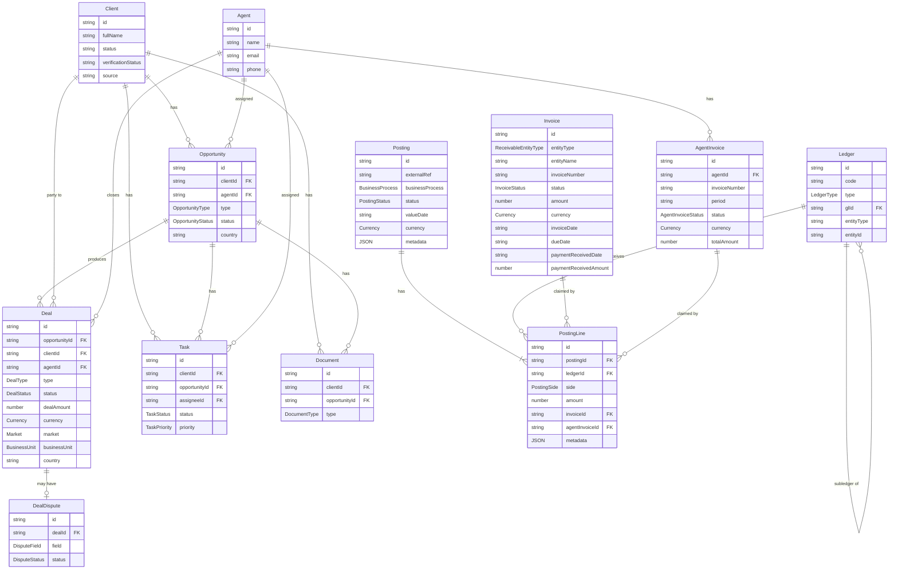

# Domain Model

All canonical types live in `src/entities.ts`. All enums live in `src/enums.ts`.

## Entity relationship diagram



> **Deal → Posting link is soft (via `metadata.deal_id`).** A `Posting` has no FK to `Deal` — this is intentional so standalone postings (bonuses, adjustments, FX bridge entries) are first-class without a deal reference. Use `getPostingsForDeal(dealId)` to query.

> **Invoice → Deal link is via PostingLine.** `Invoice` has no `dealId` FK. The receivable DEBIT `PostingLine` on a `deal_close` posting carries `invoiceId` to claim that Invoice. Use `getInvoicesForDeal(dealId)` which traverses PostingLines via `metadata.deal_id`.

## Cardinality notes

| Relationship | Cardinality | Notes |
|---|---|---|
| Client → Opportunity | 1 : N | A client can have multiple active opportunities across buy/sell/rent/mortgage |
| Agent → Opportunity | 1 : N | One agent is assigned per opportunity |
| Opportunity → Deal | 1 : N | Usually 1:1 in practice; N allowed for edge cases (e.g. deal reopened after cancellation) |
| Client → Deal | 1 : N | Denormalized FK — mirrors the Opportunity → Deal → Client path for query convenience |
| Agent → Deal | 1 : N | Primary agent on the deal; multi-agent splits live in `AgentEntry[]` |
| PostingLine → Invoice | N : 0‒1 | `invoiceId` on the receivable DEBIT line claims that line for a specific Invoice; one Invoice can span multiple PostingLines |
| PostingLine → AgentInvoice | N : 0‒1 | `agentInvoiceId` on AgentLiability CREDIT/DEBIT lines claims that line for a periodic agent statement |
| Agent → AgentInvoice | 1 : N | One AgentInvoice per agent per period |
| Deal → AgentEntry | 1 : N | Embedded — models commission splits across co-agents, team leads, managers |
| Deal → PayableEntry | 1 : N | Embedded — tracks what Huspy owes out (agent payouts, referrals, SOAs) |
| Deal → DealDispute | 1 : 0‒1 | At most one open dispute per deal |
| Client → Task | 1 : N | — |
| Opportunity → Task | 1 : N | — |
| Client → Document | 1 : N | — |
| Opportunity → Document | 1 : N | — |
| Ledger → Ledger | 1 : N | `glId` points to parent GL; null = this ledger IS the GL |
| Posting → PostingLine | 1 : N (min 2) | Every posting must have at least 2 lines; Σ DEBIT = Σ CREDIT |
| Ledger → PostingLine | 1 : N | Which ledger a line affects; for subledgers use compound key e.g. `AgentLiability_agent-felicia` |

## Invoice entity

`Invoice` is the canonical document artifact for a receivable issued to a specific counterparty. It has **no direct FK to `Deal`** — the deal link is via `PostingLine.invoiceId`: the receivable DEBIT line on the deal's `deal_close` posting claims an Invoice. Use `getInvoicesForDeal(dealId)` which traverses PostingLines.

**`entityType`** maps to `ReceivableEntityType`: `buyer | seller | developer | tenant | bank | landlord`

**Fixture coverage** (`src/fixtures/invoices.ts`):

| Invoice ID | Deal (via PostingLine) | Counterparty | Amount | Status |
|---|---|---|---|---|
| inv-001 | deal-001 (pline-001-1) | Buyer | EUR 11 550 | paid |
| inv-007 | deal-007 (pline not in fixtures) | Buyer | EUR 11 875 | sent |
| inv-008-a | deal-008 (pline-005-1) | Seller | EUR 8 700 | sent |
| inv-008-b | deal-008 (pline-005-2) | Developer | EUR 5 800 | created |
| inv-014 | deal-014 (pline-006-1) | Bank | EUR 2 480 | overdue |
| inv-015 | deal-015 | Bank | SAR 4 600 | sent |
| inv-016-a | deal-016 (pline-007-1) | Seller | AED 25 200 | paid |
| inv-016-b | deal-016 (pline-007-2) | Developer | AED 16 800 | paid |

## Deal status state machine

```
reported → pending-details → under-review → pending-agent-approval → pending-receivables → finalized
                                                                                          ↘
                                                        (any state) → canceled
```

| Status | Meaning |
|---|---|
| `reported` | Deal logged; awaiting ops review |
| `pending-details` | Ops requests more info from agent |
| `under-review` | Ops verifying details |
| `pending-agent-approval` | Ops approved; agent must confirm commission breakdown |
| `pending-receivables` | Invoice sent to client; waiting for payment to arrive |
| `finalized` | Client payment received and deal accounting closed |
| `canceled` | Deal voided (cross-cutting; can be reached from any state) |

> **`isDisputed`** (`boolean`) is a cross-cutting flag, NOT a state. A deal can be disputed at any lifecycle state. Dispute details are in the embedded `DealDispute` entity.

## Accounting model

`Ledger`, `Posting`, and `PostingLine` implement double-entry bookkeeping. They replace the embedded `AgentEntry[]` and `PayableEntry[]` arrays on `Deal` as the canonical financial record.

### Ledger hierarchy

| Ledger ID | Type | GL? | Notes |
|---|---|---|---|
| `Receivables_Buyer` | asset | GL | Amounts owed by buyers |
| `Receivables_Seller` | asset | GL | Amounts owed by sellers |
| `Receivables_Developer` | asset | GL | Amounts owed by developers |
| `Receivables_Bank` | asset | GL | Mortgage bank receivables |
| `Bank_Operating` | asset | GL | Operating bank account |
| `Revenue_Commission_REBU` | revenue | GL | REBU commission revenue |
| `Revenue_Commission_MBU` | revenue | GL | MBU/mortgage commission revenue |
| `AgentLiability` | liability | GL | Total owed to all agents (= Σ subledgers) |
| `AgentLiability_agent-*` | liability | subledger | One per agent; `glId = AgentLiability` |

### Business processes and their posting shape

| `businessProcess` | Typical lines |
|---|---|
| `deal_close` | DEBIT Receivables_*, CREDIT Revenue_Commission_* |
| `bank_statement_inbound_matched` | DEBIT Bank_Operating, CREDIT Receivables_* |
| `soa_approved` | DEBIT Revenue_Commission_*, CREDIT AgentLiability_[agentId] |
| `payout_instructed` | DEBIT AgentLiability_[agentId], CREDIT Bank_Operating |
| `bank_statement_outbound_matched` | DEBIT AgentLiability_[agentId], CREDIT Bank_Operating |
| `manual_adjustment` | Flexible — use for standalone fees, bonuses, corrections |
| `reversal` | Mirror of reversed posting with sides flipped; set `reversedByPostingId` |

### Standalone postings (no deal)

Fees or bonuses not tied to a deal have `metadata.deal_id` absent. Example: `posting-010` (Q1 performance bonus for Felicia Canovas). This is the primary reason the Deal → Posting link is soft (via metadata) rather than a FK.

### Legacy AgentEntry / PayableEntry

`AgentEntry[]` and `PayableEntry[]` on `Deal` remain in the TypeScript schema for backwards compatibility with current app components. New code should use `Posting` / `PostingLine` + `getPostingsForDeal(dealId)`.

## Legacy invoice fields on Deal

`Deal.invoiceNumber`, `Deal.invoiceStatus`, `Deal.invoiceDate`, `Deal.invoiceDueDate`, `Deal.paymentDate`, `Deal.paymentReceivedDate`, `Deal.paymentReceivedAmount` — and the same fields on `ReceivableEntry` — predate the `Invoice` entity and remain for backwards compatibility with the current app components. They are the denormalized single-invoice path. New code should use `Invoice` and `getInvoicesForDeal(dealId)` instead.
